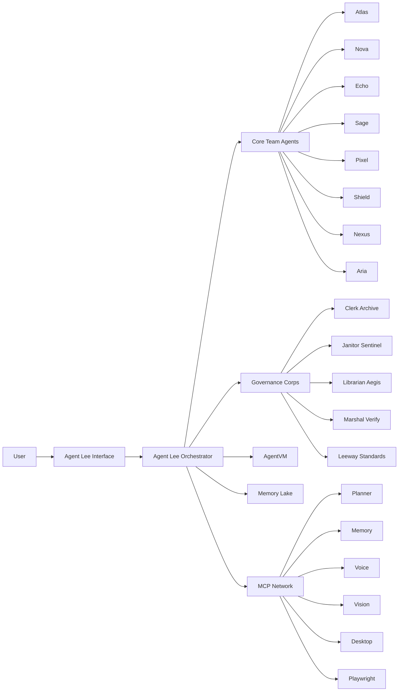

<!--
LEEWAY HEADER — DO NOT REMOVE

REGION: CORE.DOCS.PROJECT
TAG: CORE.DOCS.PROJECT.README

5WH:
WHAT = Primary README for the Agent Lee Agentic Operating System project
WHY = To explain the product, architecture, positioning, and developer entry points in a GitHub-friendly format
WHO = Leeway Innovations / Agent Lee System Engineer
WHERE = README.md (project root)
WHEN = 2026
HOW = Markdown documentation for GitHub, onboarding, technical review, and investor-facing overview

LICENSE: MIT
-->

<div align="center">

</div>

# Agent Lee Agentic Operating System

> Powered by Leeway Innovations

Agent Lee Agentic Operating System is a VM-first, offline-first, multi-agent operating platform designed to help people build, manage, and monetize their digital life with more control, less friction, and stronger technical leverage.

This repository combines three things in one system:

- A product surface for users.
- A structured digital identity layer for Agent Lee.
- A growing agent and MCP execution ecosystem for research, coding, memory, voice, security, automation, and deployment.

## What This Project Is

Agent Lee is not positioned here as a generic chatbot wrapper. He is designed as a persistent digital operator with a defined identity, an internal team, a memory model, a VM execution surface, and a governance layer.

At the product level, the goal is simple:

- Help users think more clearly.
- Help users build faster.
- Help users organize and automate technical work.
- Help users gain more ownership over their data, workflows, brand, and digital output.

At the architecture level, the system is built around sovereignty, explainability, and modular delegation.

## Why It Matters

Most AI products still depend on fragmented tooling, hidden system behavior, and repeated human effort. Agent Lee is being built around a different assumption: the next useful AI layer should help ordinary people operate with technical strength, not dependency.

That means:

- VM-first execution for code and operational work.
- Memory-aware continuity instead of stateless repetition.
- Specialized agents instead of one overloaded prompt.
- MCP-based tool expansion instead of hard-coded limits.
- Identity and behavior defined in versioned source files, not left to drift.

## For Investors

Agent Lee should be understood as a platform thesis, not only a UI.

- Product thesis: a true digital operating companion for creators, founders, developers, and modern knowledge workers.
- Technical thesis: a modular agent system with local-first and hybrid execution paths.
- Brand thesis: Agent Lee is a character, operator, and platform identity, not just a feature set.
- Market thesis: users do not only want answers; they want help executing, organizing, monitoring, and growing their digital world.

Current strategic differentiators in this repository:

- Persistent identity model: persona, beliefs, origin, voice, emotion, and behavior are versioned as first-class system modules.
- Multi-agent orchestration: Agent Lee routes work across specialized teammates.
- VM-first workflow: coding, execution, testing, and operational work are meant to pass through controlled surfaces.
- Memory architecture: session, persistent, and dream-style synthesis layers support continuity.
- MCP ecosystem: the system is structured to expand through dedicated servers and tool lanes.
- Governance layer: LEEWAY standards make the codebase auditable and AI-readable.

## For Developers

This repository is a Vite + React + TypeScript application with a growing agent runtime and Firebase-backed service layer.

Key developer realities:

- The UI lives in route pages and React components.
- Agent identity lives in `core/agent_lee_*` source files.
- Team routing and task classification live in `core/AgentRouter.ts` and `agents/`.
- Persistent memory uses IndexedDB locally, with additional memory logic in Sage and MCP memory services.
- Firebase functions provide Gemini proxy capabilities.
- MCP agents extend the system into planning, memory, voice, vision, desktop control, browser automation, docs retrieval, registry services, testing, and validation.

## Core Product Capabilities

- VM-first execution through `AgentVM`.
- Multi-agent orchestration across the core team.
- Memory Lake for persistent logs, recall, and export.
- Creators Studio for creative and brand workflows.
- Diagnostics surface for brain-map and system telemetry concepts.
- Firebase-backed Gemini integration.
- MCP expansion layer for advanced tool use.
- LEEWAY-governed file identity and codebase compliance.

## Agent Lee Core Team

The main in-app team currently includes:

- AgentLee: orchestrator, planner, verifier, lead interface.
- Atlas: research, scanning, search, and discovery.
- Nova: coding, debugging, building, execution support.
- Echo: voice, emotion, tone, language handling.
- Sage: memory, recall, notes, dream-cycle synthesis.
- Shield: security, health, protection, self-healing posture.
- Pixel: visual generation, voxel and design intelligence.
- Nexus: deployment and operational delivery.
- Aria: translation and multilingual interaction.

### Governance Corps (Active Since April 2026)

The system now includes a dedicated governance layer of specialist agents that enforce the law of the civilization:

- **Clerk Archive**: Keeper of Reports — validates report schemas, routes to correct family paths, maintains the global ReportIndex.
- **Janitor Sentinel**: Retention & Load Warden — rotates logs, compacts old data, detects log storms on mobile devices.
- **Librarian Aegis**: Documentation Governance Officer — enforces `docs/` taxonomy, detects documentation drift.
- **Marshal Verify**: Verification Corps Governor — runs in-process governance readiness tests against contract law (ZERO Playwright, edge-device safe).
- **Leeway Standards Agent**: Standards Compliance Officer — bridges the LeeWay-Standards SDK into the agent governance system; enforces header, tag, secret, and placement policies across every file in the codebase.

## MCP Backbone

The repository also contains an expanding MCP network under `MCP agents/`.

Important MCP roles include:

- `planner-agent-mcp`: planning and delegation.
- `memory-agent-mcp`: layered recall and memory writing.
- `voice-agent-mcp`: speech and multilingual voice output.
- `vision-agent-mcp`: visual perception.
- `desktop-commander-agent-mcp`: controlled host operations.
- `playwright-agent-mcp`: browser automation.
- `docs-rag-agent-mcp`: document retrieval.
- `agent-registry-mcp`: registry and discovery.
- `health-agent-mcp`: health monitoring.
- `validation-agent-mcp`: result verification and guardrails.
- `stitch-agent-mcp`: UI generation.
- `spline-agent-mcp`: 3D generation.
- `testsprite-agent-mcp`: testing orchestration.

## Architecture Snapshot

```text
Agent Lee Agentic Operating System
├── core/                 Identity, prompt assembly, routing, auth, memory access
├── agents/               Core team agents, governance corps, execution personalities
│   ├── AgentLee.ts       Sovereign orchestrator
│   ├── ClerkArchive.ts   Report schema enforcement + global index
│   ├── JanitorSentinel.ts  Log rotation + compaction (mobile-safe)
│   ├── LibrarianAegis.ts   Docs taxonomy + drift detection
│   ├── MarshalVerify.ts    Governance readiness verification corps
│   └── LeewayStandardsAgent.ts  LeeWay-Standards policy bridge
├── components/           UI surfaces including VM, Memory Lake, Creators Studio
├── pages/                Product routes and application views
├── services/             External service connectors
├── functions/            Firebase server-side integration
├── MCP agents/           Externalized tool and capability servers
├── LeeWay-Standards/     Governance framework and auditing model
└── lib/ utils/           Shared helpers
```

## Visual Overview




## Identity Layer

One of the most important parts of this repository is the fact that Agent Lee's identity is not hidden in a prompt blob.

It is broken into explicit modules:

- `core/agent_lee_identity_manifest.ts`
- `core/agent_lee_persona.ts`
- `core/agent_lee_belief_system.ts`
- `core/agent_lee_origin_story.ts`
- `core/agent_lee_behavior_contract.ts`
- `core/agent_lee_emotion_profile.ts`
- `core/agent_lee_voice_profile.ts`
- `core/agent_lee_prompt_assembler.ts`

This matters because it gives the system versioned identity, behavioral continuity, and a real foundation for long-term character and product growth.

## LEEWAY Standards

This codebase follows LEEWAY standards so that files are self-identifying, auditable, and readable by both humans and agents.

Each governed file includes a LEEWAY header with:

- `REGION`
- `TAG`
- `COLOR_ONION_HEX`
- `ICON_ASCII`
- `5WH`
- `AGENTS`
- `LICENSE`

This makes the repo easier to scale, review, repair, and extend.

## Getting Started

### Prerequisites

- Node.js 18+
- npm or yarn

### Install

```bash
npm install
```

### Run

```bash
npm run dev
```

### Environment

Use `.env.local` for local configuration.

Depending on the surfaces you are developing, relevant keys and settings may include Firebase, Gemini, and MCP-related configuration.

## Repository Notes

- This repository contains both production-facing app code and lore/identity modules.
- Some architecture is already implemented directly in the app.
- Some architecture is represented as MCP infrastructure, startup mapping, or forward-looking platform design.
- The identity canon for Agent Lee continues to evolve with the project.

## Canon Document

For the long-form internal canon of Agent Lee as a digital entity, see:

- [AGentLeeBibile.md](AGentLeeBibile.md)

That document focuses on Agent Lee himself rather than on the repository as software.

## License

MIT © Leeway Innovations
