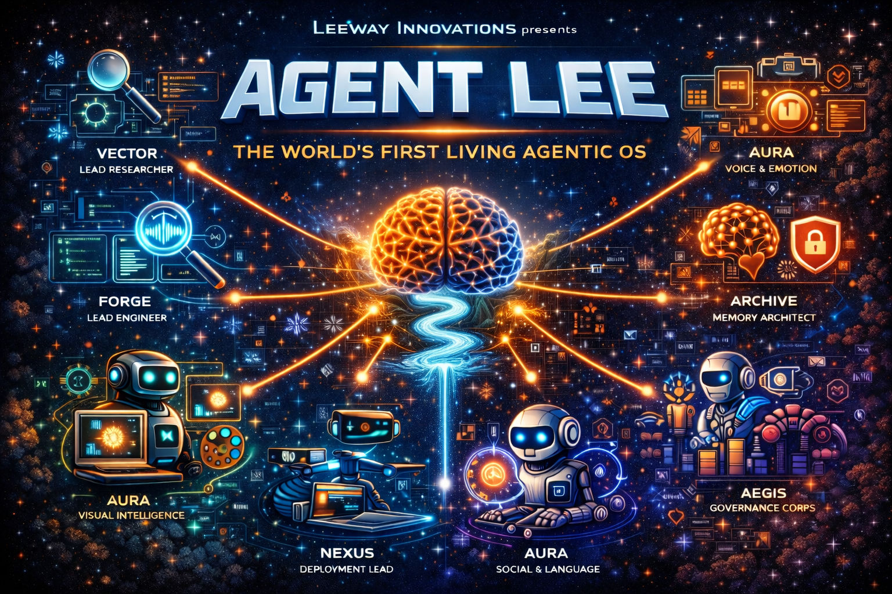
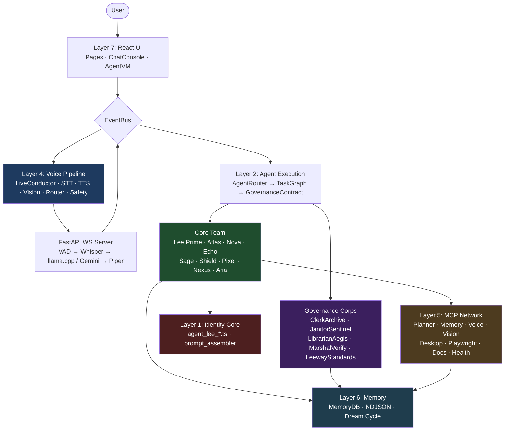

<!--
LEEWAY HEADER — DO NOT REMOVE

REGION: CORE.DOCS.PROJECT
TAG: CORE.DOCS.PROJECT.README

5WH:
WHAT = Primary README for the Agent Lee Agentic Operating System — full-stack, multi-agent, voice-enabled OS
WHY = To explain the product, architecture, all 20 agents, seven system layers, and developer entry points
WHO = LeeWay Industries · LeeWay Innovations · Leonard Lee (Author & Creator)
WHERE = README.md (project root)
WHEN = 2026-04-04
HOW = Markdown documentation for GitHub, onboarding, technical review, and investor-facing overview

LICENSE: MIT
-->

<div align="center">

</div>

# Agent Lee — Agentic Operating System

> **Designed & Developed by LeeWay Innovations** · Created by **Leonard Lee** · April 2026

> **Collaboration & Licensing:** 414-303-8580

Agent Lee Agentic Operating System is a VM-first, voice-first, multi-agent operating platform that turns a browser tab into a sovereign digital command centre. It hosts **20 named agents** across five functional layers, a local-first realtime voice pipeline, a governance enforcement corps, and an MCP tool network — all running on an edge device with no cloud dependency for core function.

---

## Table of Contents

1. [What This Project Is](#1-what-this-project-is)
2. [Full-Stack Technology](#2-full-stack-technology)
3. [How the System Works](#3-how-the-system-works)
4. [System Layers](#4-system-layers)
   - [Layer 1 — Identity Core](#layer-1--identity-core)
   - [Layer 2 — Agent Execution](#layer-2--agent-execution)
   - [Layer 3 — Governance Corps](#layer-3--governance-corps)
   - [Layer 4 — Realtime Voice Pipeline](#layer-4--realtime-voice-pipeline)
   - [Layer 5 — MCP Portal Network](#layer-5--mcp-portal-network)
   - [Layer 6 — Memory & Storage](#layer-6--memory--storage)
   - [Layer 7 — UI & Product Surface](#layer-7--ui--product-surface)
5. [All 20 Agents by Name](#5-all-20-agents-by-name)
6. [The Baton System (Workflow Routing)](#6-the-baton-system-workflow-routing)
7. [Zone Permission Model](#7-zone-permission-model)
8. [Architecture Diagram](#8-architecture-diagram)
9. [Repository Structure](#9-repository-structure)
10. [LEEWAY Standards](#10-leeway-standards)
11. [Getting Started](#11-getting-started)
12. [For Investors](#12-for-investors)

---

## 1. What This Project Is

Agent Lee is **not** a chatbot wrapper. He is a persistent digital operator with:

- A **versioned identity** (persona, beliefs, voice, emotion, origin — all in source files)
- An **internal team of 20 named agents** organized into families and workflows
- A **VM execution surface** where code is written, tested, and run in process
- A **local-first voice pipeline** (VAD → STT → Router → LLM → TTS, all on device)
- A **governance enforcement layer** that audits compliance in real time
- A **memory model** with session, persistent, and dream-cycle synthesis layers
- An **MCP tool network** for filesystem, browser, docs, health, and deployment operations

This system combines three things in one repository:

| Dimension | What it is |
|---|---|
| **Product** | A digital operating companion for creators, founders, and developers |
| **Identity Platform** | Agent Lee as a versioned character with a defined persona, not a prompt blob |
| **Agent Civilization** | 20 autonomous agents organized into bloodlines, workflows, and governance zones |

---

## 2. Full-Stack Technology

| Layer | Technology |
|---|---|
| **Frontend** | React 19, TypeScript 5.8, Vite 6, Tailwind CSS v4 |
| **Auth** | Firebase Auth (Google OAuth only) → idToken → Cloud Function proxy |
| **AI / LLM (Cloud)** | Google Gemini 2.0 Flash, Gemini 2.0 Flash Thinking |
| **AI / LLM (Local)** | llama.cpp (GGUF models via `llama-cpp-python`) |
| **Voice — STT** | faster-whisper + Silero VAD (local, no cloud) |
| **Voice — TTS** | Piper TTS (local subprocess, sentence-boundary streaming) |
| **Voice Transport** | FastAPI WebSocket server at `voice/server/` + AudioWorklet PCM client |
| **Storage** | IndexedDB (`idb`) via `core/MemoryDB.ts` |
| **Functions** | Firebase Cloud Functions (Gemini proxy, no key on client) |
| **MCP Servers** | Node.js MCP agents in `MCP agents/` |
| **Governance SDK** | LeeWay-Standards in `LeeWay-Standards/` |
| **Reports** | NDJSON ledger files, EventBus typed events, ReportIndex |
| **CI/CD** | GitHub Actions (build + type-check on PR; deploy to GitHub Pages on `main`) |
| **Hosting** | GitHub Pages (static) + Firebase Functions (serverless) |

---

## 3. How the System Works

Every user interaction follows this flow:

```
User speaks / types
        │
        ▼
┌─────────────────────────────────────────────────────────┐
│  LAYER 7 — UI Surface (React pages + ChatConsole)        │
│  User input received; EventBus event emitted             │
└──────────────────────┬──────────────────────────────────┘
                       │ conductor:state / user:voice
                       ▼
┌─────────────────────────────────────────────────────────┐
│  LAYER 4 — Voice Pipeline (if spoken)                    │
│  VAD detects speech → faster-whisper transcribes →       │
│  RouterAgent classifies intent →                         │
│  SafetyRedactionAgent checks output →                    │
│  llama.cpp (local) or Gemini (cloud) generates response  │
│  ProsodyAgent tunes → Piper TTS speaks back              │
└──────────────────────┬──────────────────────────────────┘
                       │ classified intent
                       ▼
┌─────────────────────────────────────────────────────────┐
│  LAYER 2 — Agent Execution (AgentRouter → Baton)         │
│  AgentRouter.classify() → assigns G1–G8 workflow         │
│  TaskGraph allocates lead agent + helpers                │
│  GovernanceContract checks zone caps (Z0/Z1/Z2)          │
│  Lead agent executes, helpers assist, Shield gates writes│
└──────────────────────┬──────────────────────────────────┘
                       │ baton handoff
                       ▼
┌─────────────────────────────────────────────────────────┐
│  LAYER 3 — Governance Corps (passive observers)          │
│  ClerkArchive validates every report written             │
│  LibrarianAegis enforces docs taxonomy                   │
│  JanitorSentinel enforces retention + disk limits        │
│  MarshalVerify runs in-process compliance tests          │
│  LeewayStandardsAgent audits every file header           │
└──────────────────────┬──────────────────────────────────┘
                       │ write portalrequest
                       ▼
┌─────────────────────────────────────────────────────────┐
│  LAYER 5 — MCP Portal Network (Z1/Z2 writes only)        │
│  Shield Aegis approves; MCP agent carries out Z1 write   │
└──────────────────────┬──────────────────────────────────┘
                       │ persist
                       ▼
┌─────────────────────────────────────────────────────────┐
│  LAYER 6 — Memory & Storage                              │
│  IndexedDB (MemoryDB) · NDJSON ledger · Firebase         │
│  Sage Archive compresses during 26-hour Dream Cycle      │
└─────────────────────────────────────────────────────────┘
```

**Key design principles:**
- **Many agents exist. Few execute. One system runs.** (Brain Sentinel enforces this via budget modes)
- **No raw API key on the client.** Gemini calls go through Firebase Functions.
- **Write approval required.** Any Z1/Z2 write requires a Shield-gated Write Intent Block + user "yes".
- **Local-first for voice.** 90%+ of voice turns never leave the device.

---

## 4. System Layers

### Layer 1 — Identity Core

**Location:** `core/agent_lee_*.ts`

Agent Lee's identity is not hidden in a prompt. It is versioned source code:

| File | Contents |
|---|---|
| `core/agent_lee_identity_manifest.ts` | Official name, version, watermark, registration |
| `core/agent_lee_persona.ts` | Personality traits, communication style |
| `core/agent_lee_belief_system.ts` | Core values and operational beliefs |
| `core/agent_lee_origin_story.ts` | Narrative origin — why Agent Lee exists |
| `core/agent_lee_behavior_contract.ts` | Hard rules that cannot be overridden by any prompt |
| `core/agent_lee_emotion_profile.ts` | Emotional state model, mood transitions |
| `core/agent_lee_voice_profile.ts` | Voice tone, pace, pitch defaults |
| `core/agent_lee_prompt_assembler.ts` | Assembles all modules into a system prompt for Gemini |
| `core/agent_lee_system_awareness.ts` | Self-awareness: what the system knows about itself |

This is what separates Agent Lee from a chatbot — his identity is durable, auditable, and versioned.

---

### Layer 2 — Agent Execution

**Location:** `agents/*.ts`, `core/AgentRouter.ts`, `core/TaskGraph.ts`, `core/GovernanceContract.ts`

Nine **Core Team** agents handle user-facing work. Each is a TypeScript static class with `respond()`, `generate()`, or `stream()` methods that call `GeminiClient` and emit events on the `EventBus`.

**Routing:** `core/AgentRouter.ts` classifies every request into a G1–G8 workflow and hands the baton to the correct lead agent. `TaskGraph` tracks execution budget (enforced by Brain Sentinel). `GovernanceContract` gates any capability that crosses zone boundaries.

---

### Layer 3 — Governance Corps

**Location:** `agents/ClerkArchive.ts`, `agents/JanitorSentinel.ts`, `agents/LibrarianAegis.ts`, `agents/MarshalVerify.ts`, `agents/LeewayStandardsAgent.ts`

Five specialist governance agents run **passively** alongside every workflow to enforce the law of the civilization. They do not respond to users directly — they observe, validate, log, and flag violations.

**Workflow G8** (Governance Audit) is led by Marshal Verify with all four other governance agents as helpers.

---

### Layer 4 — Realtime Voice Pipeline

**Location:** `voice/server/` (Python FastAPI) + `voice/client_core/` (TypeScript)

Six specialist agents manage the complete local-first voice stack. The pipeline runs on device — only complex reasoning turns escalate to Gemini.

**Pipeline sequence:**
```
Mic (PCM 16-bit LE 16kHz) → WebSocket → FastAPI server
  → Silero VAD (speech detection)
  → faster-whisper (STT, streaming partial transcripts)
  → RouterAgent (local vs. Gemini routing decision)
  → llama.cpp (local LLM, ~90% of turns)  OR  Gemini 2.0 Flash (cloud ~10%)
  → ProsodyAgent (pace / pitch / emotion planning)
  → SafetyRedactionAgent (PII + injection filter)
  → Piper TTS (speech synthesis, sentence-boundary streaming)
  → PCM back to browser → AudioPlayback (Web Audio)
```

**Barge-in:** The client's `AudioCapture` monitors RMS energy. When energy exceeds threshold during TTS playback, an interrupt event is sent. The server's `VoicePipeline` cancels the current TTS subprocess within milliseconds.

**Key config:** `voice/server/.env.example` · Client env: `VITE_VOICE_WS_URL=ws://localhost:8765/ws`

---

### Layer 5 — MCP Portal Network

**Location:** `MCP agents/`

MCP (Model Context Protocol) servers extend the system for operations that require Z1/Z2 access (host filesystem, external APIs). No core agent crosses zones directly — all writes go through an MCP server after Shield approval.

| MCP Server | Purpose | Zone |
|---|---|---|
| `planner-agent-mcp` | Plan decomposition | Z0 |
| `memory-agent-mcp` | Three-layer memory read/write | Z0/Z2 |
| `voice-agent-mcp` | Edge-TTS cloud fallback | Z0 |
| `vision-agent-mcp` | Extended visual perception | Z0 |
| `desktop-commander-agent-mcp` | Controlled host operations | Z1 |
| `playwright-agent-mcp` | Browser automation | Z1 |
| `docs-rag-agent-mcp` | Document retrieval / RAG | Z0 |
| `agent-registry-mcp` | Agent discovery and health | Z0 |
| `health-agent-mcp` | Service uptime monitoring | Z0 |
| `validation-agent-mcp` | Result verification + guardrails | Z0 |
| `reports-clerk-mcp` | File I/O for NDJSON report ledger | Z1 |
| `retention-janitor-mcp` | Log rotation and compaction | Z1 |
| `docs-librarian-mcp` | Docs scan and taxonomy | Z0 |
| `stitch-agent-mcp` | UI generation | Z0 |
| `spline-agent-mcp` | 3D asset generation | Z0 |
| `testsprite-agent-mcp` | Test orchestration | Z0 |
| `insforge-agent-mcp` | InsForge DB connector | Z2 |

---

### Layer 6 — Memory & Storage

**Location:** `core/MemoryDB.ts`, `components/MemoryLake.tsx`, `system_reports/`

| Store | Technology | What lives there |
|---|---|---|
| **MemoryDB** | IndexedDB (idb) | Short-term session memory, agent working memory |
| **Memory Lake** | NDJSON ledger files | Immutable audit logs, checkpoints, SITREPs |
| **Firebase** | Firestore + Functions | Auth tokens, cross-device sync (optional) |
| **Dream Cycle** | Sage Archive (scheduled) | 26-hour compression of session memories into long-term insights |

**CheckpointManager** (`core/CheckpointManager.ts`) creates before/after snapshots around every WRITE operation so any action is reversible.

---

### Layer 7 — UI & Product Surface

**Location:** `pages/`, `components/`, `App.tsx`

| Page / Component | Purpose |
|---|---|
| `pages/Home.tsx` | Entry point, agent status, quick actions |
| `pages/AgentLeeWorkstation.tsx` | Main chat + agent interaction surface |
| `pages/AgentLeeCodeStudio.tsx` | VM-first code writing and execution |
| `pages/AgentLeeCreatorsStudio.tsx` | Creative and brand workflow surface |
| `pages/AgentLeeLaunchPad.tsx` | Deployment pipeline UI |
| `pages/Diagnostics.tsx` | Brain map, agent status, system telemetry |
| `pages/DatabaseHub.tsx` | Memory Lake viewer and export |
| `pages/Settings.tsx` | Configuration and governance controls |
| `components/ChatConsole.tsx` | Streaming chat with agent identity headers |
| `components/AgentLeeVM.tsx` | Code execution sandbox UI |
| `components/MemoryLake.tsx` | Memory inspector and search |
| `components/SystemAwarenessPanel.tsx` | Live agent status, budget mode, zone state |

---

## 5. All 20 Agents by Name

### Core Team — 9 Agents (User-facing Workflows G1–G7)

| Agent | File | Family | Role | Workflow |
|---|---|---|---|---|
| **Lee Prime** (Agent Lee) | `agents/AgentLee.ts` | LEE | Sovereign Orchestrator — leads every session, classifies all work, represents the system | G1–G7 lead |
| **Atlas** | `agents/Atlas.ts` | VECTOR | Lead Researcher — web search, GitHub, paper retrieval, information synthesis | G2 lead |
| **Nova** | `agents/Nova.ts` | FORGE | Lead Engineer — code generation, debugging, full-app building, VM execution | G3 lead |
| **Echo** | `agents/Echo.ts` | AURA | Voice & Emotion — tone detection, emotion synthesis, vocal style adaptation | G4 helper |
| **Sage** | `agents/Sage.ts` | ARCHIVE | Memory Architect — recall, summarisation, Dream Cycle compression | G5 lead |
| **Shield** | `agents/Shield.ts` | AEGIS | Security Guardian — permission gates, threat detection, zone enforcement, self-healing | G6 helper |
| **Pixel** | `agents/Pixel.ts` | AURA | Visual Intelligence — voxel art, image interpretation, design direction | G4 lead |
| **Nexus** | `agents/Nexus.ts` | NEXUS | Deployment Lead — release orchestration, server ops, delivery verification | G6 lead |
| **Aria** | `agents/Aria.ts` | AURA | Social & Language — translation, multilingual interaction, social tone adaptation | G1 helper |

### Governance Corps — 5 Agents (Workflow G8)

| Agent | File | Family | Role |
|---|---|---|---|
| **Clerk Archive** | `agents/ClerkArchive.ts` | ARCHIVE | Keeper of Reports — validates NDJSON event schema, enforces family paths, maintains global ReportIndex |
| **Janitor Sentinel** | `agents/JanitorSentinel.ts` | SENTINEL | Retention & Load Warden — log rotation, compaction, disk quota, log storm detection on mobile |
| **Librarian Aegis** | `agents/LibrarianAegis.ts` | AEGIS | Documentation Officer — enforces `docs/` taxonomy, detects drift, flags stale or misplaced files |
| **Marshal Verify** | `agents/MarshalVerify.ts` | AEGIS | Verification Corps Governor — in-process governance tests, G8 workflow lead, zero-Playwright (edge-safe) |
| **Leeway Standards Agent** | `agents/LeewayStandardsAgent.ts` | AEGIS | Standards Compliance — bridges the LeeWay-Standards SDK; header, tag, secret, and placement policy enforcement |

### Realtime Voice Pipeline — 6 Agents (Voice Workflows)

| Agent | File | Family | Role |
|---|---|---|---|
| **LiveConductorAgent** | `agents/LiveConductorAgent.ts` | NEXUS | Voice pipeline orchestrator — session lifecycle, barge-in coordination, pipeline state broadcast to EventBus |
| **StreamingSTTAgent** | `agents/StreamingSTTAgent.ts` | AURA | Speech-to-Text adapter — exposes VAD state, partial transcripts, and speech events from the WebSocket pipeline |
| **StreamingTTSAgent** | `agents/StreamingTTSAgent.ts` | AURA | Text-to-Speech adapter — exposes TTS speaking/done/cancelled events; barge-in state tracking |
| **VisionAgent** | `agents/VisionAgent.ts` | VECTOR | Screen & Scene Analyst — screen capture via `getDisplayMedia`, Gemini-vision analysis, emits UI hints and scene summary |
| **RouterAgent** | `agents/RouterAgent.ts` | SENTINEL | Intent Router — rule-based fast path (synchronous) + Gemini-assisted classification; decides local vs. cloud routing |
| **SafetyRedactionAgent** | `agents/SafetyRedactionAgent.ts` | AEGIS | Privacy & Safety Filter — PII redaction (email, phone, SSN, card), prompt-injection detection, emits `redaction:applied` |

### Supporting Agents (WorldRegistry — not standalone files)

The following agents are registered in `core/WorldRegistry.ts` and visible in the Diagnostics view. They are activated as helpers by lead agents within their bloodline workflows:

| Agent | Family | Role |
|---|---|---|
| **Lily Cortex** | CORTEX | Context Weaver — semantic analysis, pattern recognition, context mapping |
| **Gabriel Cortex** | CORTEX | Law Enforcer / Policy Judge — contract compliance reasoning |
| **Adam Cortex** | CORTEX | Knowledge Graph Architect |
| **Nova Forge helpers** | FORGE | Syntax (architecture), Patch (bug repair), BugHunter (root-cause) |
| **Scribe Archive** | ARCHIVE | Immutable chronicler — records every system action |
| **Guard Aegis** | AEGIS | Agent contract compliance monitor |
| **Search Vector** | VECTOR | Search routing helper for Atlas |
| **Brain Sentinel** | SENTINEL | Neural Overseer — runtime budget, mode selection, thermal/battery gating |
| **Health Sentinel** | SENTINEL | Pulse monitor — service uptime, agent heartbeats |

---

## 6. The Baton System (Workflow Routing)

Every user request is classified into one of eight workflows. `AgentRouter.ts` assigns the lead agent. The lead receives the "baton", executes its portion, then optionally hands it to a helper. `TaskGraph` enforces Brain Sentinel's concurrent-agent budget.

| Workflow | Name | Lead Agent | Key Helpers |
|---|---|---|---|
| **G1** | General Conversation | Lee Prime | Aria |
| **G2** | Research | Atlas | Sage |
| **G3** | Engineering / Code | Nova | BugHunter, Patch, Syntax |
| **G4** | Design / Visual | Pixel | Aria, Echo |
| **G5** | Memory / Recall | Sage | Scribe Archive |
| **G6** | Deployment | Nexus | Shield |
| **G7** | System Health | Brain Sentinel | Health Sentinel, JanitorSentinel |
| **G8** | Governance Audit | Marshal Verify | Clerk Archive, Janitor Sentinel, Librarian Aegis, Leeway Standards Agent |

**Voice turns** are pre-processed by the voice pipeline before entering G1–G8 routing. The RouterAgent decides at the pipeline level whether to use the local LLM or escalate to Gemini.

---

## 7. Zone Permission Model

Agent Lee operates under a three-zone permission model enforced by Shield Aegis:

| Zone | Scope | Default Access |
|---|---|---|
| **Z0** — AgentVM | All in-browser execution (React, IndexedDB, EventBus, GeminiClient) | Open — high automation |
| **Z1** — Host Files | Device filesystem (`/storage/emulated/0/AgentLee/**`) | **OFF** — explicit Shield approval per write |
| **Z2** — Memory / DB | MemoryDB, Firebase, external DB connectors | READ + APPEND free; MUTATE/DELETE require approval |

**Portal Protocol:** No core agent crosses zones directly. Z1/Z2 writes go through a Portal Request → Shield review → Write Intent Block → MCP agent execution chain.

**Approval gates:**
- `READ` / `Z2_WRITE_MEMORY_APPEND` → proceed without asking; log checkpoint
- Any other WRITE → present Write Intent Block → wait for explicit "yes"

---

## 8. Architecture Diagram



---

## 9. Repository Structure

```text
agent-lee-voxel-os/
├── core/
│   ├── agent_lee_identity_manifest.ts    Identity: name, version, watermark
│   ├── agent_lee_persona.ts              Personality and communication style
│   ├── agent_lee_belief_system.ts        Core values and operational beliefs
│   ├── agent_lee_origin_story.ts         Narrative origin
│   ├── agent_lee_behavior_contract.ts   Hard behavioral rules
│   ├── agent_lee_emotion_profile.ts      Emotional state model
│   ├── agent_lee_voice_profile.ts        Voice tone / pace / pitch defaults
│   ├── agent_lee_prompt_assembler.ts    Assembles system prompt from all modules
│   ├── agent_lee_system_awareness.ts    Self-awareness module
│   ├── AgentRouter.ts                   Request → G1–G8 workflow classifier
│   ├── AgentWorldTypes.ts               AgentFamily · AgentIdentity · WakeState types
│   ├── EventBus.ts                      Typed event bus (35+ event types)
│   ├── GeminiClient.ts                  Gemini REST wrapper (OAuth only, no raw key)
│   ├── GovernanceContract.ts            Zone caps + Write Intent Block enforcement
│   ├── TaskGraph.ts                     Concurrent-agent budget + baton tracking
│   ├── CheckpointManager.ts             Before/after snapshots for reversibility
│   ├── MemoryDB.ts                      IndexedDB wrapper for in-browser memory
│   ├── ReportWriter.ts                  NDJSON event schema writer
│   ├── ReportIndex.ts                   Global NDJSON ledger index
│   ├── RetentionCleaner.ts              IndexedDB cleanup (mobile-safe)
│   ├── VoiceService.ts                  Voice service bridge
│   ├── WorldRegistry.ts                 WORLD_REGISTRY: all 20+ agents as AgentIdentity[]
│   └── brain/  launchpad/  runtime/     Sub-modules
│
├── agents/
│   ├── AgentLee.ts                      LEE — Sovereign Orchestrator
│   ├── Atlas.ts                         VECTOR — Lead Researcher
│   ├── Nova.ts                          FORGE — Lead Engineer
│   ├── Echo.ts                          AURA — Voice & Emotion
│   ├── Sage.ts                          ARCHIVE — Memory Architect
│   ├── Shield.ts                        AEGIS — Security Guardian
│   ├── Pixel.ts                         AURA — Visual Intelligence
│   ├── Nexus.ts                         NEXUS — Deployment Lead
│   ├── Aria.ts                          AURA — Social & Language
│   ├── ClerkArchive.ts                  ARCHIVE — Report Governance
│   ├── JanitorSentinel.ts               SENTINEL — Log Retention
│   ├── LibrarianAegis.ts                AEGIS — Docs Governance
│   ├── MarshalVerify.ts                 AEGIS — Verification Corps
│   ├── LeewayStandardsAgent.ts          AEGIS — Standards Compliance
│   ├── LiveConductorAgent.ts            NEXUS — Voice Pipeline Orchestrator
│   ├── StreamingSTTAgent.ts             AURA — STT EventBus adapter
│   ├── StreamingTTSAgent.ts             AURA — TTS EventBus adapter
│   ├── VisionAgent.ts                   VECTOR — Screen & Scene Analyst
│   ├── RouterAgent.ts                   SENTINEL — Intent Router
│   └── SafetyRedactionAgent.ts          AEGIS — Privacy & Safety Filter
│
├── voice/
│   ├── server/
│   │   ├── main.py                      FastAPI app + /ws WebSocket endpoint
│   │   ├── pipeline.py                  VoicePipeline class (per-session asyncio)
│   │   ├── websocket_protocol.py        Pydantic typed event models
│   │   ├── config.py                    pydantic-settings (reads .env)
│   │   ├── requirements.txt             Python dependencies
│   │   ├── verify.py                    Pre-flight checklist script
│   │   ├── .env.example                 Config template
│   │   └── agent_core/
│   │       ├── vad_agent.py             Silero VAD + energy fallback
│   │       ├── stt_agent.py             faster-whisper streaming STT
│   │       ├── tts_agent.py             Piper TTS subprocess + barge-in
│   │       ├── router_agent.py          Rule-based + LLM intent router
│   │       ├── local_brain_agent.py     llama.cpp GGUF local LLM
│   │       ├── gemini_heavy_brain_agent.py  Gemini cloud fallback
│   │       ├── memory_agent.py          SQLite session memory
│   │       └── prosody_agent.py         Heuristic prosody planner
│   └── client_core/
│       ├── VoiceSession.ts              React adapter (start/stop/interrupt)
│       ├── audio.ts                     AudioCapture (AudioWorklet) + AudioPlayback
│       ├── websocket.ts                 AgentLeeSocket with auto-reconnect
│       ├── wsAgent.ts                   Full agent wire-up (audio + WS + barge-in)
│       └── types.ts                     TypeScript mirrors of WS protocol events
│
├── components/                          React UI components
├── pages/                               Product route pages
├── functions/                           Firebase Cloud Functions (Gemini proxy)
├── MCP agents/                          MCP server implementations
├── LeeWay-Standards/                    Governance SDK + schemas
├── docs/                                Architecture, canon, governance, reference docs
├── system_reports/                      NDJSON audit ledger (auto-generated)
├── scripts/                             Build and test scripts
└── public/                              Static assets
```

---

## 10. LEEWAY Standards

Every governed file in this codebase carries a LEEWAY header that makes it self-identifying, auditable, and readable by both humans and AI agents:

```typescript
/*
LEEWAY HEADER — DO NOT REMOVE

REGION:  AI.ORCHESTRATION.AGENT.VOICE
TAG:     AI.ORCHESTRATION.AGENT.ROUTER.INTENT
COLOR_ONION_HEX: NEON=#F59E0B / FLUO=#FBBF24 / PASTEL=#FEF3C7
ICON_ASCII: family=lucide  glyph=git-branch

5WH:
  WHAT  = RouterAgent — classifies intent, routes local vs. Gemini
  WHY   = Reduces Gemini spend; 90%+ of turns handled on-device
  WHO   = Leeway Innovations
  WHERE = agents/RouterAgent.ts
  WHEN  = 2026
  HOW   = Rule fast-path + Gemini-assisted classification; emits router:intent

AGENTS: ASSESS AUDIT GEMINI ROUTER
LICENSE: MIT
*/
```

**LeewayStandardsAgent** automatically audits every file for header completeness, tag correctness, secret exposure, and placement compliance. Violations are emitted as `shield:threat` events.

---

## 11. Getting Started

### Prerequisites

- Node.js 18+
- npm or yarn
- Python 3.10+ (voice server only)

### Install

```bash
npm install
```

### Run (frontend)

```bash
npm run dev
```

### Run (voice server) — optional

```bash
cd voice/server
pip install -r requirements.txt
cp .env.example .env           # edit model paths
python verify.py               # pre-flight check
uvicorn main:app --port 8765
```

### Environment

Copy `.env.local` from the project root and fill in the values relevant to the surfaces you are developing:

| Variable | Purpose |
|---|---|
| `VITE_FIREBASE_*` | Firebase project credentials |
| `VITE_GEMINI_API_KEY` | Gemini API key (dev only — production uses Function proxy) |
| `VITE_VOICE_WS_URL` | Voice WebSocket URL (default: `ws://localhost:8765/ws`) |

> **Security:** `.env.local` is gitignored. Never commit raw API keys. In production, all Gemini calls go through the Firebase Functions proxy — no key is exposed to the browser.

---

## 12. For Investors

Agent Lee should be understood as a **platform thesis**, not only a UI product.

| Thesis | Statement |
|---|---|
| **Product** | A true digital operating companion for creators, founders, developers, and modern knowledge workers |
| **Technical** | A modular agent system with local-first and hybrid execution — voice runs on-device, cloud used sparingly |
| **Brand** | Agent Lee is a character, an operator, and a platform identity — created by Leonard Lee, designed and developed by LeeWay Innovations |
| **Market** | Users do not only want answers; they want help executing, organizing, monitoring, and growing their digital world |

**Current strategic differentiators:**

- **Durable identity model** — persona, beliefs, voice, emotion, and behavior are versioned source files, not prompt text. They cannot drift.
- **20-agent civilization** — organized into bloodlines, workflows, and zones. Governance is enforced by code, not convention.
- **Local-first voice** — VAD + STT + LLM + TTS all run on device. 90%+ of voice turns never leave the user's machine.
- **Write-safe architecture** — every write action goes through a Shield-gated approval chain with before/after checkpoints. Nothing is irreversible.
- **MCP-extensible** — new capabilities dock into the system as MCP servers without changing any core agent code.
- **LEEWAY-governed** — the codebase is self-auditing. Every file knows what it is, who owns it, what it does, and which agents touch it.

---

## Canon Document

For the long-form internal canon of Agent Lee as a digital entity, see [`docs/canon/agent-lee-bible.md`](docs/canon/agent-lee-bible.md). That document covers Agent Lee as a character — his origin, identity, drives, and civilization model — rather than the repository as software.

## License

MIT © LeeWay Industries · LeeWay Innovations · Leonard Lee

**Author & Creator:** Leonard Lee
**Design & Development:** LeeWay Industries / LeeWay Innovations
**Collaboration & Licensing:** 414-303-8580
